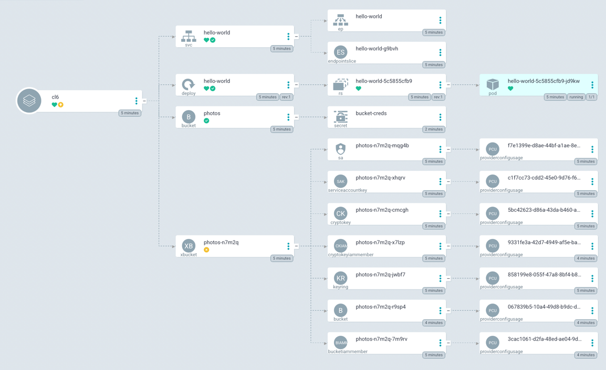
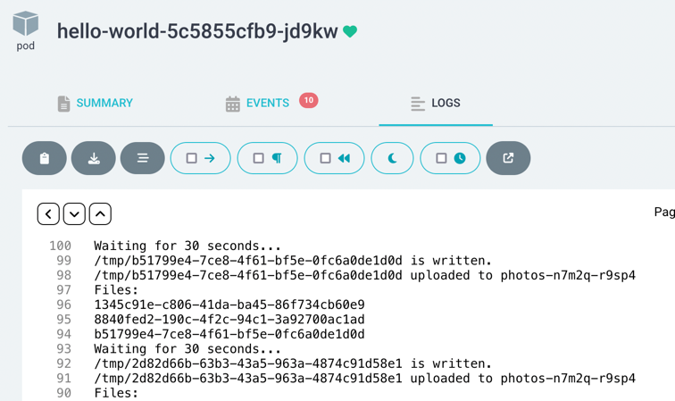

# Add Infrastructure

Many applications require infrastructure such as databases, buckets, caches, you
name it. We will use Crossplane claims in our Helm chart to request these
resources.

In this tutorial, we will:
* Create a new API in our cluster for applications to request infratructure
  from.
* Create a new `Composition` that will provision a `Bucket` in Google Cloud
  Platform to back that API.
* Add our new API to our Backstage software template and used it to create
  a new service.

We will create our own Kubernetes API for a GCP `Bucket` that is encrypted so
that everyone using our software templates can use only the golden path defined
by the platform team to get their infrastructure. Everyone will use encrypted
bucket and they won't need to have cloud credentials to provision one.

> You can find the final template for this tutorial in the
> [templates/04-crossplane](templates/04-crossplane) folder.

Before doing all that, let's copy our software template from the earlier step.
```bash
# We are in the template repo, i.e. {your username}/cloud-native-heroku on Github.
cp -a templates/03-argocd templates/04-crossplane
```

Change the metadata of our template.
```yaml
# Change in templates/04-crossplane/template.yaml
metadata:
  name: nodejs-with-bucket
  title: NodeJS Application with Bucket
```

First, define our new API.
```yaml
# cat <<EOF | kubectl apply -f - (then Shift+Enter, paste the content, Shift+Enter, EOF, Enter)
apiVersion: apiextensions.crossplane.io/v1
kind: CompositeResourceDefinition
metadata:
  name: xbuckets.kubecon.org
spec:
  group: kubecon.org
  names:
    kind: XBucket
    plural: xbuckets
  claimNames:
    kind: Bucket
    plural: buckets
  connectionSecretKeys:
    - bucketName
    - googleCredentialsJSON
  versions:
  - name: v1alpha1
    served: true
    referenceable: true
    schema:
      openAPIV3Schema:
        type: object
        properties:
          spec:
            type: object
            properties:
              location:
                type: string
                description: |
                  The location for Bucket and the KMS key to be created in.
                  See https://cloudgoogle.com/kms/docs/locations for available locations.
            required:
            - location
          status:
            type: object
            properties:
              serviceAccountEmail:
                type: string
              kmsKeyId:
                type: string
```

Let's create a `Composition` to back that API.

```yaml
# cat <<EOF | kubectl apply -f - (then Shift+Enter, paste the content, Shift+Enter, EOF, Enter)
apiVersion: apiextensions.crossplane.io/v1
kind: Composition
metadata:
  name: encrypted.xbuckets.kubecon.org
  labels:
    provider: gcp
spec:
  writeConnectionSecretsToNamespace: heroku
  compositeTypeRef:
    apiVersion: kubecon.org/v1alpha1
    kind: XBucket
  resources:
    - name: bucket
      base:
        apiVersion: storage.gcp.upbound.io/v1beta1
        kind: Bucket
        spec:
          forProvider:
            storageClass: MULTI_REGIONAL
            forceDestroy: true
      patches:
        - fromFieldPath: status.kmsKeyId
          toFieldPath: encryption.defaultKmsKeyName
          policy:
            fromFieldPath: Required
        - fromFieldPath: spec.location
          toFieldPath: spec.forProvider.location
      connectionDetails:
        - type: FromFieldPath
          name: bucketName
          fromFieldPath: metadata.annotations[crossplane.io/external-name]
    - name: serviceaccount
      base:
        apiVersion: cloudplatform.gcp.upbound.io/v1beta1
        kind: ServiceAccount
        spec:
          forProvider: {}
      patches:
        - type: CombineFromComposite
          toFieldPath: spec.forProvider.description
          policy:
            fromFieldPath: Required
          combine:
            variables:
              - fromFieldPath: spec.claimRef.namespace
              - fromFieldPath: spec.claimRef.name
            strategy: string
            string:
              fmt: "%s/%s"
        - type: ToCompositeFieldPath
          fromFieldPath: status.atProvider.email
          toFieldPath: status.serviceAccountEmail
          policy:
            fromFieldPath: Required
    - name: serviceaccountkey
      base:
        apiVersion: cloudplatform.gcp.upbound.io/v1beta1
        kind: ServiceAccountKey
        spec:
          forProvider:
            publicKeyType: TYPE_X509_PEM_FILE
            serviceAccountIdSelector:
              matchControllerRef: true
          writeConnectionSecretToRef:
            namespace: heroku
      patches:
        - type: CombineFromComposite
          combine:
            variables:
              - fromFieldPath: metadata.uid
            strategy: string
            string:
              fmt: "%s-serviceaccountkey"
          toFieldPath: spec.writeConnectionSecretToRef.name
          policy:
            fromFieldPath: Required
      connectionDetails:
        - name: googleCredentialsJSON
          fromConnectionSecretKey: private_key
    - name: add-sa-to-bucket
      base:
        apiVersion: storage.gcp.upbound.io/v1beta1
        kind: BucketIAMMember
        spec:
          forProvider:
            bucketSelector:
              matchControllerRef: true
            role: roles/storage.objectAdmin
      patches:
        - type: CombineFromComposite
          combine:
            variables:
              - fromFieldPath: status.serviceAccountEmail
            strategy: string
            string:
              fmt: "serviceAccount:%s"
          toFieldPath: spec.forProvider.member
          policy:
            fromFieldPath: Required
    - name: keyring
      base:
        apiVersion: kms.gcp.upbound.io/v1beta1
        kind: KeyRing
        spec:
          forProvider: {}
      patches:
        - type: FromCompositeFieldPath
          fromFieldPath: spec.location
          toFieldPath: spec.forProvider.location
    - name: cryptokey
      base:
        apiVersion: kms.gcp.upbound.io/v1beta1
        kind: CryptoKey
        spec:
          forProvider:
            destroyScheduledDuration: 86400s
            keyRingSelector:
              matchControllerRef: true
            rotationPeriod: 100000s
      patches:
        - type: ToCompositeFieldPath
          fromFieldPath: status.atProvider.id
          toFieldPath: status.kmsKeyId
          policy:
            fromFieldPath: Required
    - name: add-sa-to-cryptokey
      base:
        apiVersion: kms.gcp.upbound.io/v1beta1
        kind: CryptoKeyIAMMember
        spec:
          forProvider:
            cryptoKeyIdSelector:
              matchControllerRef: true
            role: roles/cloudkms.cryptoKeyEncrypterDecrypter
      patches:
        - type: CombineFromComposite
          combine:
            variables:
              - fromFieldPath: status.serviceAccountEmail
            strategy: string
            string:
              fmt: "serviceAccount:%s"
          toFieldPath: spec.forProvider.member
          policy:
            fromFieldPath: Required
```

Let's create a claim to give it a try.

```yaml
# cat <<EOF | kubectl apply -f - (then Shift+Enter, paste the content, Shift+Enter, EOF, Enter)
apiVersion: kubecon.org/v1alpha1
kind: Bucket
metadata:
  name: hello-bucket
  namespace: default
spec:
  location: us
  writeConnectionSecretToRef:
    name: bucket-creds
```

Once that's ready, we'll extract the bucket path and the credentials to see if
we are able to access it.

You can see individual cloud resources being created by running the following
command:
```bash
kubectl get managed
```

Let's wait till all resources are created and the claim is in `Ready` state.
```bash
kubectl -n default get buckets --watch
```

Once it is ready, we will extract the credentials of the `ServiceAccount` that
is created as part of the `Composition` and use it in our sample application.

```bash
kubectl -n default get secret bucket-creds -o jsonpath="{.data.googleCredentialsJSON}" | base64 -d > /tmp/bucket-creds.json
export GOOGLE_APPLICATION_CREDENTIALS=/tmp/bucket-creds.json
```

```bash
export BUCKET_NAME=$(kubectl -n default get secret bucket-creds -o jsonpath="{.data.bucketName}" | base64 -d)
```

A simple Nodejs application that uploads dummy file and prints the list of files
in the bucket every 30 seconds. Let's edit our `server.js` file to have the
following content.
```javascript
// Content of templates/04-crossplane/skeleton/server.js
const {Storage} = require('@google-cloud/storage');
var fs = require('fs');
var os = require('os');
var uuid = require('uuid');


const bucketName = process.env.BUCKET_NAME;
// Assumes GOOGLE_APPLICATION_CREDENTIALS env var is available.
const storage = new Storage();

async function run() {
  const start = Date.now();
  const timeout = 30 * 60 * 1000; // 30 minutes
  while (start + timeout > Date.now()) {
    // Write to disk.
    const filePath = `${os.tmpdir()}/${uuid.v4()}`
    fs.writeFile(filePath, "mydata", function (err) {
      console.log(`${filePath} is written.`);
    })
    // Upload.
    await storage.bucket(bucketName).upload(filePath);
    console.log(`${filePath} uploaded to ${bucketName}`);
    // List.
    const [files] = await storage.bucket(bucketName).getFiles();
    console.log('Files:');
    files.forEach(file => {
      console.log(file.name);
    });
    console.log("Waiting for 30 seconds...")
    await new Promise(resolve => setTimeout(resolve, 30 * 1000));
  }
}
run().catch(console.error);
```

The `package.json` should include `@google-cloud/storage` as
dependency.
```bash
yarn add --cwd templates/04-crossplane/skeleton @google-cloud/storage
```

Now run the program!
```bash
node templates/04-crossplane/skeleton/server.js
```

If you see a log like the following, congrats! 🎉
```
/var/folders/l1/8wn3dp1s6bv6l1z8c4_xkqfw0000gn/T/dcf065a7-d4c1-494b-b77a-32b10d85f72c is written.
/var/folders/l1/8wn3dp1s6bv6l1z8c4_xkqfw0000gn/T/dcf065a7-d4c1-494b-b77a-32b10d85f72c uploaded to hello-bucket-5xhpm-kdvmm
Files:
dcf065a7-d4c1-494b-b77a-32b10d85f72c
```

Let's clean up the infra.
```bash
kubectl -n default delete buckets hello-bucket
```

# Use Infrastructure in Applications

We now have our own API in the cluster, `Bucket` in the `kubecon.org` group that
will provision several cloud resources and give us an encrypted private `Bucket`
that we can operate on with the given credentials.

Let's add it to our Helm chart in our Backstage software template.
```yaml
# Content of templates/04-crossplane/skeleton/chart/templates/bucket.yaml
apiVersion: kubecon.org/v1alpha1
kind: Bucket
metadata:
  name: photos
spec:
  location: us
  writeConnectionSecretToRef:
    name: bucket-creds
```

Let's mount the connection secret to our application.
```yaml
# Addition to templates/04-crossplane/skeleton/chart/templates/service.yaml
          env:
            - name: BUCKET_NAME
              valueFrom:
                secretKeyRef:
                  name: bucket-creds
                  key: bucketName
                  optional: false
            - name: GOOGLE_APPLICATION_CREDENTIALS
              value: "/creds/creds.json"
          volumeMounts:
          - name: creds
            mountPath: "/creds"
            readOnly: true
      volumes:
      - name: creds
        secret:
          secretName: bucket-creds
          optional: false
          items:
          - key: googleCredentialsJSON
            path: creds.json
```

It should look like the following:
```yaml
# The full content of templates/04-crossplane/skeleton/chart/templates/service.yaml
apiVersion: v1
kind: Service
metadata:
  name: hello-world
spec:
  selector:
    app: hello-world
  ports:
    - name: http
      port: 80
      targetPort: http
---
apiVersion: apps/v1
kind: Deployment
metadata:
  name: hello-world
spec:
  replicas: 1
  selector:
    matchLabels:
      app: hello-world
  template:
    metadata:
      labels:
        app: hello-world
    spec:
      containers:
        - name: hello-world
          image: ghcr.io/${{ values.githubRepositoryOrg }}/${{ values.githubRepositoryName }}:{{ .Values.image.tag }}
          ports:
            - name: http
              containerPort: 8080
          env:
            - name: BUCKET_NAME
              valueFrom:
                secretKeyRef:
                  name: bucket-creds
                  key: bucketName
                  optional: false
            - name: GOOGLE_APPLICATION_CREDENTIALS
              value: "/creds/creds.json"
          volumeMounts:
          - name: creds
            mountPath: "/creds"
            readOnly: true
      volumes:
      - name: creds
        secret:
          secretName: bucket-creds
          optional: false
          items:
          - key: googleCredentialsJSON
            path: creds.json
```

Keep in mind that `CompositeResourceDefinition` and `Composition` we created
need to be in the cluster already - they are defined once and used by all
instances of our API. We can have different `Composition`s in different clusters
backing the same API with different tiers of infrastructure!

Before committing our changes, let's add a `.gitignore` so that `node_modules` is
not included in our repo.
```bash
echo "node_modules" >> templates/04-crossplane/skeleton/.gitignore
```

Now commit and push our new template!

```bash
git add .
git commit -s -m "templates: add 04-crossplane"
git push
```

Add our new template to Backstage in `http://127.0.0.1:7007/catalog-import`
by providing the path to our new `template.yaml` file in Github.
```
https://github.com/muvaf/cloud-native-heroku/blob/main/templates/04-crossplane/template.yaml
```

Create a new service using our shiny new `NodeJS Application with Bucket` template
and you'll see the following happening:
* Git repo created.
* Image and chart are pushed to GHCR.
* ArgoCD fetches the chart and deploys it to your cluster.
* Bucket is created and the credentials are mounted to the application.
* Your application is up and operating on the bucket.

If all things above happened, congratulate yourself! 🎉




Jump to the [next steps](05-next-steps.md) page to see what you can do next!